<h3>hi 👋 everyone !! </h3>

I 💻 am currently Working on a website development that supports webinar's registrations features, companies publication page, update about upcoming events 
along with their <strong>content management page</strong> for updating posts over the website. 

<h3>these are my contribution to the project in my ongoing internship.</h3>

I have designed a beautiful and completely responsive website for a webinar platform.
this website supports features like sign-in and sign-up form which is connected with databases for storing data of the user.
I have also added an authentication system to some pages (publications section therein navbar)due to which users can't visit those pages until they logged in first.
apart from that also added feedback and queries form for taking user data.
<h4>Tools used : Node.js, Express.js , HBS, as backend and MongoDB for databases and javascript, HTML, CSS for fronted part.</h4>
<h3>Below are the screenshots of my work.</h3>

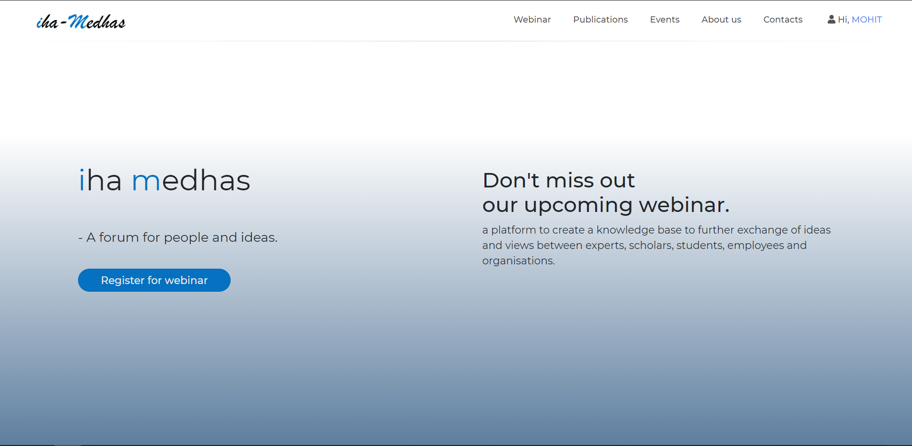
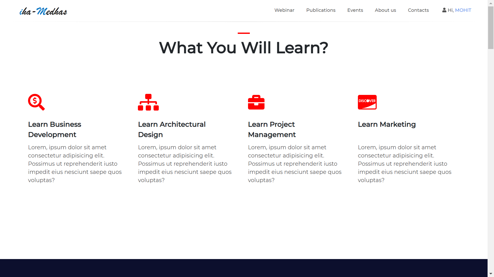
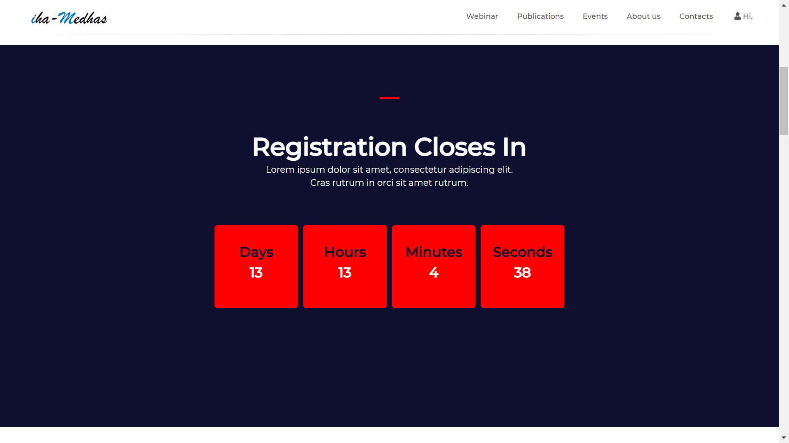
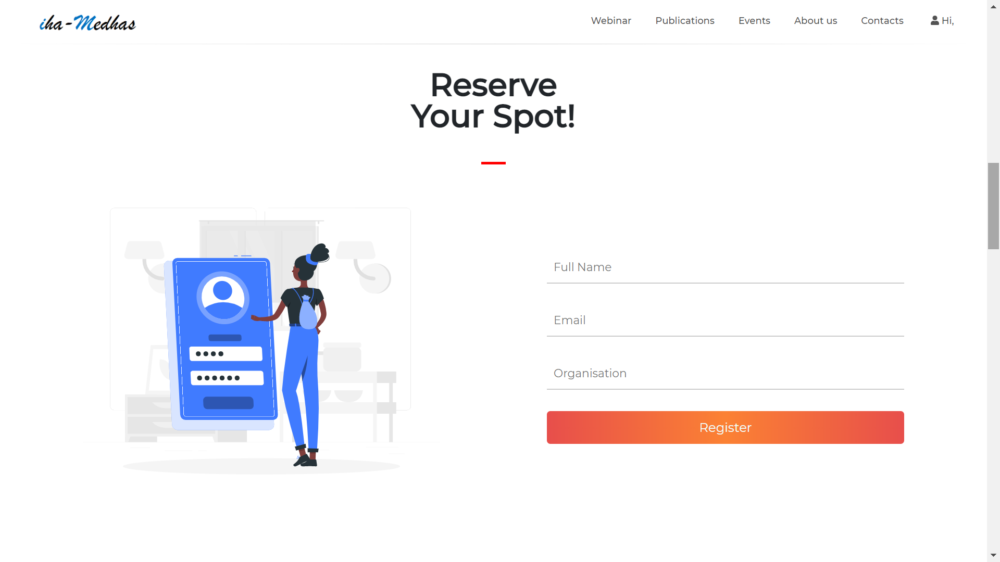
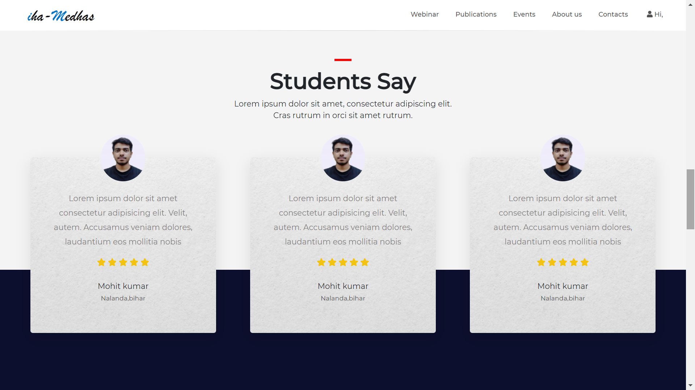
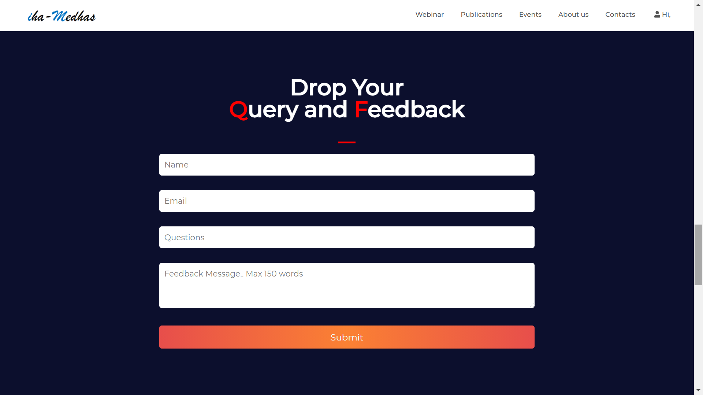
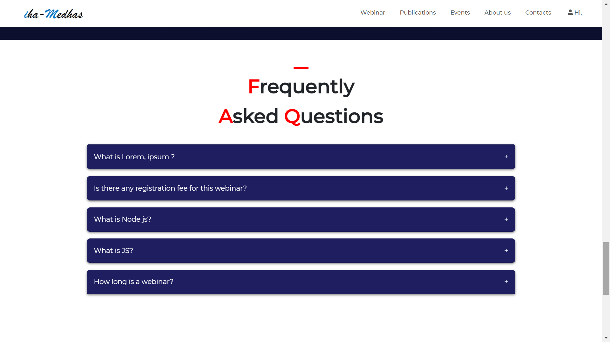
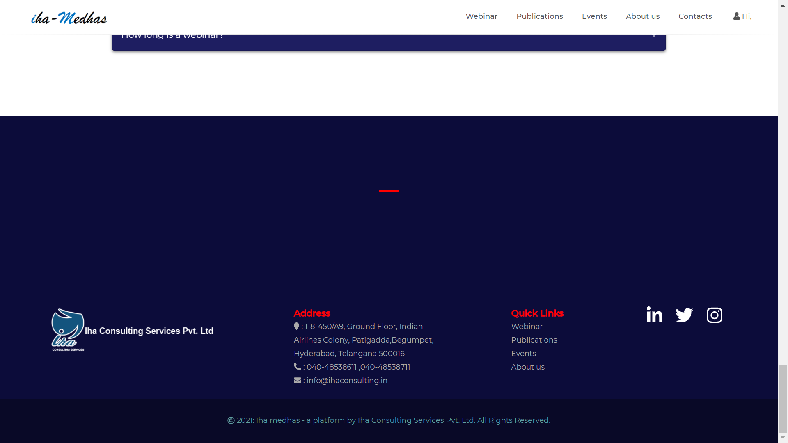
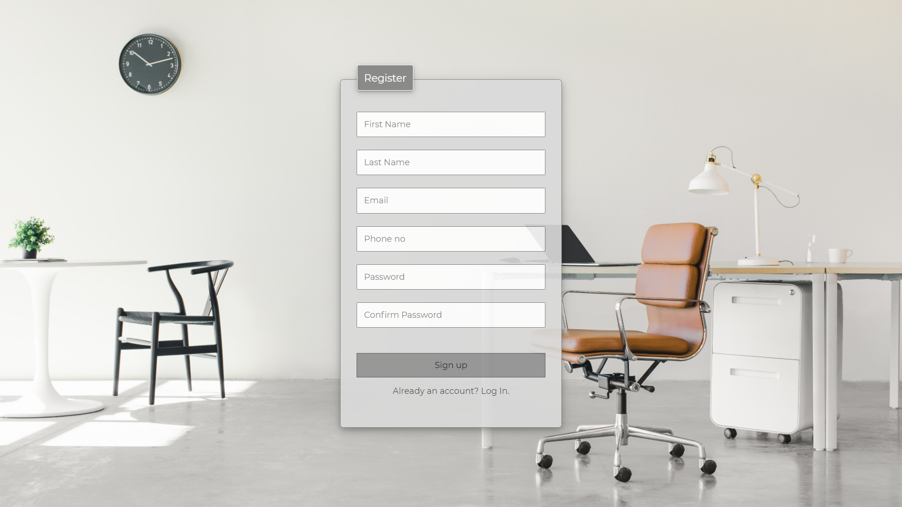
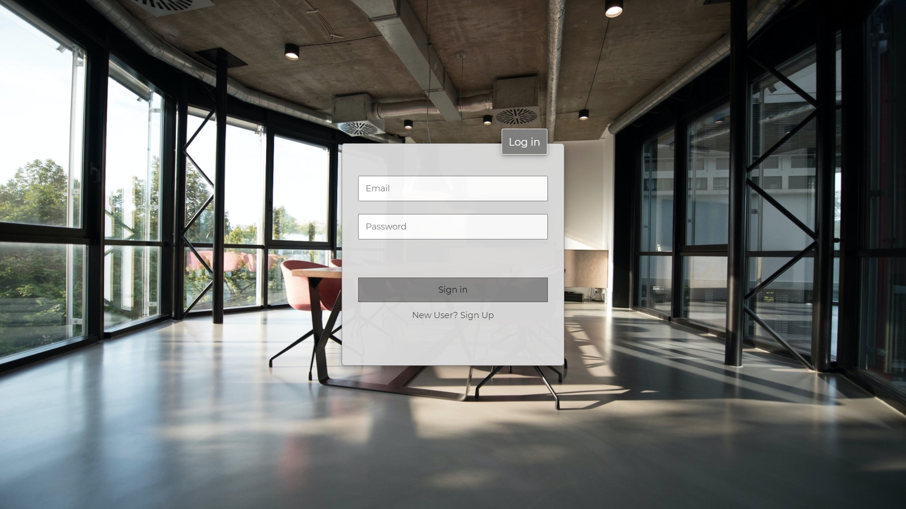
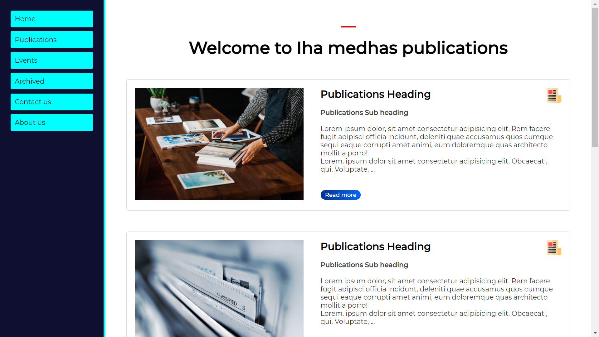
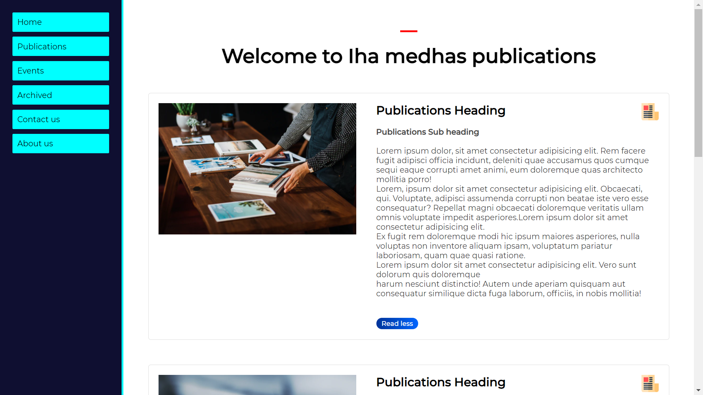
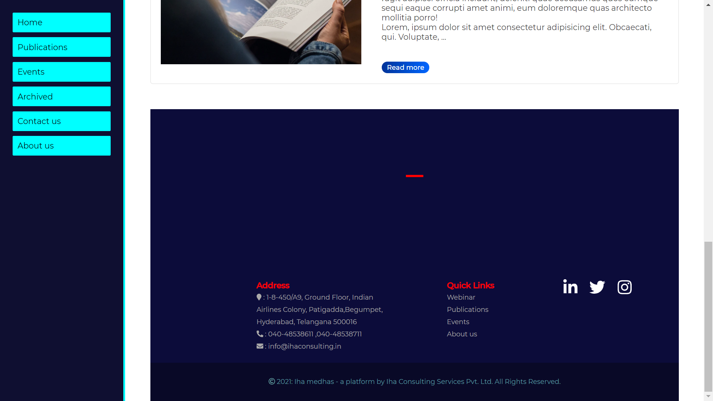

### thanks !!